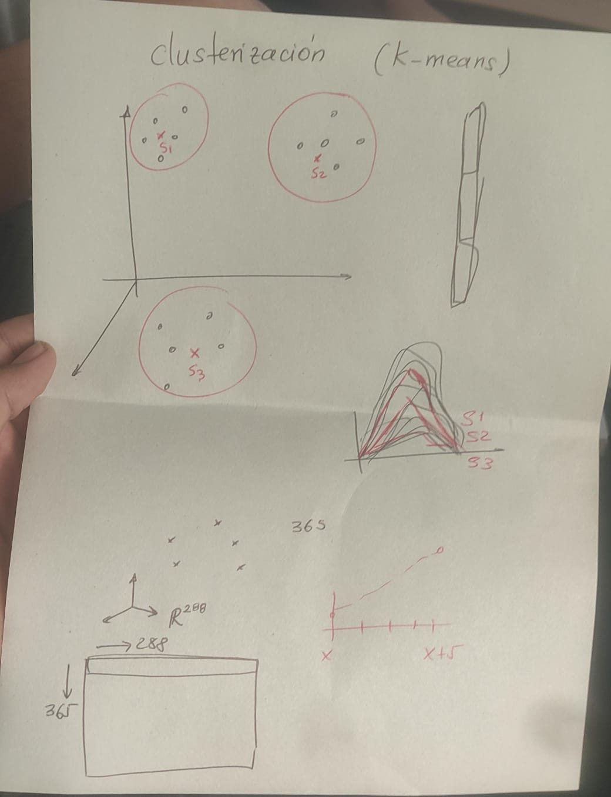
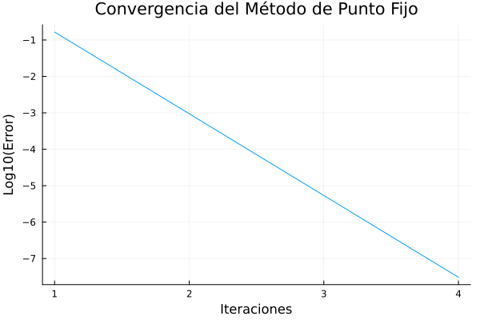
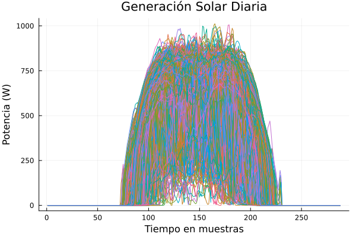
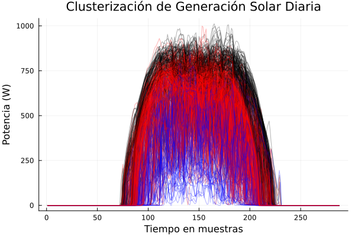
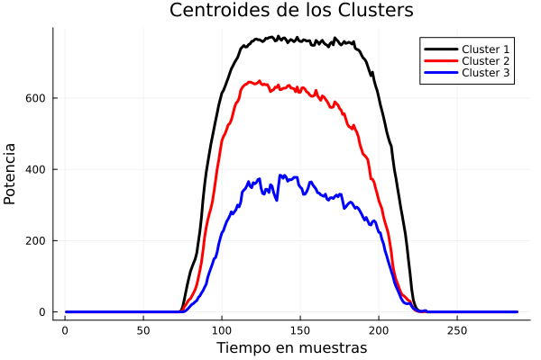
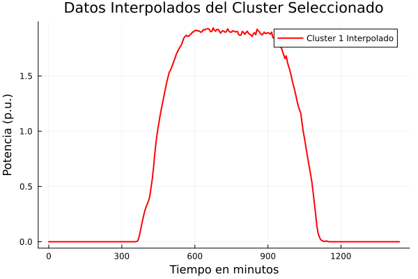

##
## Theoretical Framework

### Power Flow in Electrical Systems

**Description:** Power systems constitute the fundamental infrastructure for the generation, transmission, and distribution of electrical energy. Power flow analysis determines the steady-state electrical condition of a network.

- **Complex Power and Nodal Representation:**
  - The complex power $(S)$ at a node is: ${S = P + jQ = V \cdot I^*}$
  - ${P}$ is the active power
  - ${Q}$ is the reactive power
  - ${V}$ is the complex voltage
  - ${I}$ is the complex current

### Admittance Matrix (Ybus)

**Description:** The admittance matrix represents the electrical characteristics of the network and is fundamental for power flow analysis.

- **Matrix Elements:**
  - Diagonal elements: ${Y_{kk} = \sum_{m} Y_{km}}$ (sum of all admittances connected to node k)
  - Off-diagonal elements: ${Y_{km} = -Y_{km}}$ (negative of the admittance between nodes k and m)
  - For a line between nodes k and m: ${Y_{km} = \frac{1}{R_{km} + jX_{km}}}$
  - ${R_{km}}$ is the line resistance
  - ${X_{km}}$ is the line reactance

### Fixed-Point Method for Power Flow

**Description:** The fixed-point method is an iterative approach to solve the nonlinear power flow equations.

- **Mathematical Formulation:**
  - For PQ nodes (where P and Q are known), the iteration is:
  - ${V_n^{(k+1)} = Y_{nn}^{-1} \cdot (\frac{S_n^*}{V_n^{(k)*}} - Y_{ns} \cdot V_s)}$
  - ${V_n}$ are the voltages at non-slack nodes
  - ${Y_{nn}}$ is the submatrix of Ybus for non-slack nodes
  - ${S_n}$ are the nodal complex powers
  - ${Y_{ns}}$ connects non-slack nodes to the slack node
  - ${V_s}$ is the voltage at the slack node

### Basin of Attraction

**Description:** Defines the region in the initial state space where the fixed-point method converges to a stable solution.

- **Characteristics:**
  - For a system of the form ${x_{k+1} = f(x_k)}$, the basin of attraction determines for which initial values the method will converge
  - In power systems, this reveals for which initial voltage values a physically valid solution will be obtained
  - The stability of the method significantly depends on the initial conditions

### Analysis of Solar Generation and Demand Data

**Description:** The analysis of solar generation and demand data is crucial for the planning and operation of modern power systems.

- **Importance:**
  - Allows understanding of generation and consumption patterns
  - Facilitates the prediction of future behavior
  - Helps identify critical operating conditions
  - Essential for the integration of renewable energies

### K-means Clustering for Solar Generation Profiles

**Description:** Unsupervised learning technique that groups similar patterns of solar generation based on their daily behavior.

- **Algorithm:**
  - Initial K centroids are selected
  - Each daily profile is assigned to the nearest centroid
  - Centroids are recalculated as the average of the profiles in each cluster
  - The process is repeated until convergence is achieved

- **Graphic whit mayor appreciation**

### Applications in Distribution Networks with High Solar Penetration

**Description:** Analyzes the effects of distributed solar generation on electrical networks.

- **Critical Aspects:**
  - **Voltage Variations:** Fluctuations in solar generation can cause significant variations
  - **System Stability:** Dynamic behavior can be affected by solar variability
  - **Algorithm Convergence:** The convergence capability of power flow methods may be reduced
  - **Optimal Operation:** Requires considering the variability and uncertainty of solar generation

##
## Marco Teórico

### Flujo de Potencia en Sistemas Eléctricos

**Descripción:** Los sistemas de potencia eléctrica constituyen la infraestructura fundamental para la generación, transmisión y distribución de energía eléctrica. El análisis de flujo de potencia determina el estado eléctrico en régimen permanente de una red.

- **Potencia Compleja y Representación Nodal:**
  - La potencia compleja $(S)$ en un nodo es: ${S = P + jQ = V \cdot I^*}$
  - ${P}$ es la potencia activa
  - ${Q}$ es la potencia reactiva
  - ${V}$ es el voltaje complejo
  - ${I}$ es la corriente compleja

### Matriz de Admitancias (Ybus)

**Descripción:** La matriz de admitancias representa las características eléctricas de la red y es fundamental para el análisis de flujo de potencia.

- **Elementos de la matriz:**
  - Elementos diagonales: ${Y_{kk} = \sum_{m} Y_{km}}$ (suma de todas las admitancias conectadas al nodo k)
  - Elementos fuera de la diagonal: ${Y_{km} = -Y_{km}}$ (negativa de la admitancia entre los nodos k y m)
  - Para una línea entre nodos k y m: ${Y_{km} = \frac{1}{R_{km} + jX_{km}}}$
  - ${R_{km}}$ es la resistencia de la línea
  - ${X_{km}}$ es la reactancia de la línea

### Método de Punto Fijo para Flujo de Potencia

**Descripción:** El método de punto fijo es un enfoque iterativo para resolver las ecuaciones no lineales de flujo de potencia.

- **Formulación matemática:**
  - Para nodos PQ (donde se conocen P y Q), la iteración es:
  - ${V_n^{(k+1)} = Y_{nn}^{-1} \cdot (\frac{S_n^*}{V_n^{(k)*}} - Y_{ns} \cdot V_s)}$
  - ${V_n}$ son los voltajes en nodos sin slack
  - ${Y_{nn}}$ es la submatriz de Ybus para nodos sin slack
  - ${S_n}$ son las potencias complejas nodales
  - ${Y_{ns}}$ conecta los nodos sin slack con el nodo slack
  - ${V_s}$ es el voltaje en el nodo slack

### Cuenca de Atracción

**Descripción:** Define la región en el espacio de estados iniciales donde el método de punto fijo converge a una solución estable.

- **Características:**
  - Para un sistema de la forma ${x_{k+1} = f(x_k)}$, la cuenca de atracción determina para qué valores iniciales el método convergerá
  - En sistemas de potencia, esto revela para qué valores iniciales de voltaje se obtendrá una solución físicamente válida
  - La estabilidad del método depende significativamente de las condiciones iniciales

### Análisis de Datos de Generación Solar y Demanda

**Descripción:** El análisis de datos de generación solar y demanda es crucial para la planificación y operación de sistemas de potencia modernos.

- **Importancia:**
  - Permite comprender patrones de generación y consumo
  - Facilita la predicción de comportamiento futuro
  - Ayuda a identificar condiciones críticas de operación
  - Esencial para la integración de energías renovables

### Clusterización K-means para Perfiles de Generación Solar

**Descripción:** Técnica de aprendizaje no supervisado que agrupa patrones similares de generación solar basados en su comportamiento diario.

- **Algoritmo:**
  - Se seleccionan K centroides iniciales
  - Se asigna cada perfil diario al centroide más cercano
  - Se recalculan los centroides como el promedio de los perfiles en cada cluster
  - Se repite hasta alcanzar la convergencia

- **Grafico para tener mejor apreciación**

### Aplicaciones en Redes de Distribución con Alta Penetración Solar

**Descripción:** Analiza los efectos de la generación solar distribuida en las redes eléctricas.

- **Aspectos críticos:**
  - **Variación de voltajes:** Las fluctuaciones en la generación solar pueden causar variaciones significativas
  - **Estabilidad del sistema:** El comportamiento dinámico puede verse afectado por la variabilidad solar
  - **Convergencia de algoritmos:** La capacidad de convergencia de los métodos de flujo de potencia puede reducirse
  - **Operación óptima:** Requiere considerar la variabilidad e incertidumbre de la generación solar
## Funciones

### `carga_datos()`

**Descripción:** Función para cargar los datos de las líneas y nodos.

- **Entradas:** Ninguna.
- **Salidas:**
  - `lin`: DataFrame con los datos de las líneas.
  - `nod`: DataFrame con los datos de los nodos.
  - `num_lin`: Número de líneas.
  - `num_nod`: Número de nodos.

### `crear_diccionario(filepath::String)`

**Descripción:** Crea un diccionario a partir de los datos de las líneas.

- **Entradas:**
  - `filepath`: Ruta del archivo CSV con los datos de las líneas.
- **Salidas:**
  - `diccionario`: Diccionario con los valores de las columnas `FROM` y `TO` sin la letra "N".

### `crear_diccionario_nodes(filepath::String)`

**Descripción:** Crea un diccionario a partir de los datos de los nodos.

- **Entradas:**
  - `filepath`: Ruta del archivo CSV con los datos de los nodos.
- **Salidas:**
  - `diccionario1`: Diccionario con los valores de las columnas `NUMBER` y `NAME` sin la letra "N".

### `crear_Ykmimg(lin, num_nod)`

**Descripción:** Crea la matriz de admitancias del sistema.

- **Entradas:**
  - `lin`: DataFrame con los datos de las líneas.
  - `num_nod`: Número de nodos.
- **Salidas:**
  - `Ykm`: Matriz de admitancias.

### `y_bus_inv(lin, num_nod)`

**Descripción:** Calcula la inversa de la matriz de admitancias.

- **Entradas:**
  - `lin`: DataFrame con los datos de las líneas.
  - `num_nod`: Número de nodos.
- **Salidas:**
  - `Ykm_inv`: Inversa de la matriz de admitancias.

### `crear_ynn_yns(Ykm, lin, nod)`

**Descripción:** Crea las matrices de admitancias de los nodos sin slack y el vector de admitancias de los nodos quitando el slack.

- **Entradas:**
  - `Ykm`: Matriz de admitancias.
  - `lin`: DataFrame con los datos de las líneas.
  - `nod`: DataFrame con los datos de los nodos.
- **Salidas:**
  - `Yn`: Matriz de admitancias de los nodos sin slack.
  - `Yns`: Vector de admitancias de los nodos quitando el slack.

### `calcular_vn_vs(nod)`

**Descripción:** Calcula los voltajes de los nodos sin slack y el voltaje del slack.

- **Entradas:**
  - `nod`: DataFrame con los datos de los nodos.
- **Salidas:**
  - `Vn`: Voltajes de los nodos sin slack.
  - `Vs`: Voltaje del slack.

### `calcular_potencia_neta(nodes)`

**Descripción:** Calcula la potencia neta de los nodos.

- **Entradas:**
  - `nodes`: DataFrame con los datos de los nodos.
- **Salidas:**
  - `Sn`: Vector de potencias complejas.

### `flujo_punto_fijo(ynn, yns, sn, vn, vs)`

**Descripción:** Realiza el flujo de potencia utilizando el método de punto fijo.

- **Entradas:**
  - `ynn`: Matriz de admitancias de los nodos sin slack.
  - `yns`: Vector de admitancias de los nodos quitando el slack.
  - `sn`: Vector de potencias complejas.
  - `vn`: Voltajes de los nodos sin slack.
  - `vs`: Voltaje del slack.
- **Salidas:**
  - `vn`: Voltajes de los nodos sin slack.
  - `vs`: Voltaje del slack.
  - `errores`: Vector de errores por iteración.
  - `ite`: Vector de iteraciones.

### `leer_demandas(filepath::String)`

**Descripción:** Lee las demandas desde un archivo CSV y las convierte en vectores columna.

- **Entradas:**
  - `filepath`: Ruta del archivo CSV con los datos de demandas.
- **Salidas:**
  - `demandas`: Lista de vectores columna con las demandas.

### `agrupar_por_dias(file_path::String)`

**Descripción:** Agrupa los datos por días.

- **Entradas:**
  - `file_path`: Ruta del archivo CSV con los datos.
- **Salidas:**
  - `datos_agrupados`: Diccionario con los datos agrupados por días.

### `graficar_generacion_por_dia(datos_agrupados::Dict{Int, DataFrame})`

**Descripción:** Grafica la generación solar por día.

- **Entradas:**
  - `datos_agrupados`: Diccionario con los datos agrupados por días.
- **Salidas:** Ninguna (muestra la gráfica y guarda el archivo PNG).

### `guardar_bloques_en_vectores(datos_agrupados::Dict{Int, DataFrame})`

**Descripción:** Guarda los bloques de datos en vectores.

- **Entradas:**
  - `datos_agrupados`: Diccionario con los datos agrupados por días.
- **Salidas:**
  - `vectores_dias`: Vector de DataFrames con los datos agrupados por días.

### `clusterizar_generacion_solar(datos_agrupados::Dict{Int, DataFrame}, k::Int)`

**Descripción:** Realiza la clusterización de la generación solar utilizando k-means.

- **Entradas:**
  - `datos_agrupados`: Diccionario con los datos agrupados por días.
  - `k`: Número de clusters.
- **Salidas:**
  - `datos_interpolados_pu_vector`: Vector con los datos interpolados y normalizados.

### `calcular_potencia_neta2(nodes, demandas, generacion)`

**Descripción:** Calcula la potencia neta de los nodos considerando las demandas y la generación solar.

- **Entradas:**
  - `nodes`: DataFrame con los datos de los nodos.
  - `demandas`: Vector con las demandas.
  - `generacion`: Generación solar interpolada.
- **Salidas:**
  - `Sn1`: Vector de potencias complejas.

### `graficar_voltajes_por_minuto(voltajes_por_minuto)`

**Descripción:** Grafica los voltajes en p.u. por minuto.

- **Entradas:**
  - `voltajes_por_minuto`: Lista de voltajes por minuto.
- **Salidas:** Ninguna (muestra la gráfica y guarda el archivo PNG).

### `main()`

**Descripción:** Función principal que coordina la carga de datos, el cálculo de la matriz de admitancias, el flujo de potencia en operación normal, el análisis de contingencias y la visualización de resultados.

- **Entradas:** Ninguna.
- **Salidas:** Ninguna (muestra los resultados en la consola y gráficos).

## Ejecución

Para ejecutar el análisis, simplemente corre el archivo `prueba.jl` en Julia. Los resultados se mostrarán en la consola.

## Graficos obtenidos
**Grafico de convergencia sin incluir generacion solar**
___

- **NOTA:Debido al gasto computacional este grafico se obtuvo con el caso base $tol = 1e-6$ y $k = 4$**
___
**Generacion solar diaria (cada muestra equivale a 5 minutos)**
___

___
**Clusterizacion de la generacion solar (k = 4)**
___

___
**Centroides obtenidos (dias  tipicos en el año)**
___

___
**Interpolacion de la generacion solar (dia mas soleado)**
___

___
## Resultados del algoritmo de punto fijo
- **Nota: los resultados varian dependiendo de la precision al ser una ejecucion de 1440 minutos que equivalen a 1 dia, la ejecucion tarda bastante si se utilizan muchos espacios o una tolerancia muy baja, para ver resultados usar $tol = 1, k = 2 (baja_{presicion}) $, ademas se genera un .csv con la interpolacion, aunque ya se proporciona directamente en este repositorio.**

**Licencias**

Flujo punto fijo, k-means, penetracion solar by Yohan V. is licensed under <a href="https://creativecommons.org/licenses/by/4.0/?ref=chooser-v1" target="_blank" rel="license noopener noreferrer" style="display:inline-block;">CC BY 4.0</a>
